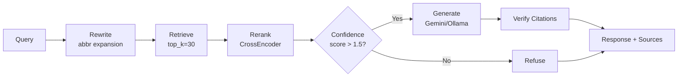

# НПА Ассистент — RAG-система для нормативных правовых актов РК

AI-ассистент по обращению медицинских изделий в Республике Казахстан.  
Отвечает строго на основе НПА, проверяет цитаты против галлюцинаций, отказывается от вопросов вне домена.

> Интерфейс воспроизводит визуальный язык публичного бота НЦЭЛС ([ai-bot.stat.gov.kz](https://ai-bot.stat.gov.kz)) и демонстрирует, как туда можно интегрировать прозрачную RAG-систему с карточками источников, индикаторами уверенности и автоматическими метриками качества.

---

## Метрики качества (eval-набор: 28 вопросов)

| Метрика | v0 baseline | v1 |
|---------|-------------|-----|
| Hit Rate @ 5 | 45.5% | 45.5% |
| MRR | 0.341 | 0.341 |
| Keyword Coverage | 42.2% | **51.6%** |
| Refusal Correctness | 85.7% | **92.9%** |
| Citation Integrity | 65.4% | **91.7%** |
| Latency p50 | 22s | 27s |

Полная история → [`eval/ITERATIONS.md`](eval/ITERATIONS.md)  
Live dashboard → `/dashboard` (после запуска)

---

## Архитектура

```
User → Next.js (SSE streaming)
         ↓
   FastAPI /api/query/stream
         ↓
   LangGraph StateGraph:
     rewrite → retrieve → rerank → check_confidence
                                       ↓              ↓
                                    generate        refuse
                                       ↓
                                    verify
         ↓
   Qdrant (dense search, 3609 чанков)
   CrossEncoder reranker (mmarco-mMiniLMv2-L12-H384-v1)
   LLM: Gemini 2.5 Flash (prod) / qwen2.5:7b (local)
```



---

## Технические решения

| Компонент | Выбор | Почему не альтернатива |
|-----------|-------|------------------------|
| Embedder | `intfloat/multilingual-e5-large` | Лучше OpenAI ada-002 на русском; работает локально на M1 |
| Reranker | `cross-encoder/mmarco-mMiniLMv2-L12-H384-v1` | Многоязычный; +26pp Citation Integrity vs без reranker |
| Vector DB | Qdrant | Фильтрация по метаданным, hybrid search; vs Chroma/Weaviate |
| LLM (prod) | Gemini 2.5 Flash | 1M контекст, дёшево, хорошо работает с русским/казахским |
| LLM (dev) | qwen2.5:7b via Ollama | Локально без затрат API при итерациях |
| Chunking | Structure-aware (Глава→Статья→Пункт) | НПА имеют чёткую иерархию; чанки по статьям = точные ссылки |
| Orchestration | LangGraph | Условные рёбра для отказов; граф версионируется |

---

## Быстрый старт

### Требования
- Docker + Docker Compose
- (для локальной разработки) Python 3.12+, Node.js 20+, [uv](https://docs.astral.sh/uv/), Ollama

### С Docker (рекомендуется)

```bash
git clone <repo>
cd npa-assistant

# Настрой переменные окружения
cp backend/.env.example backend/.env
# Вставь GEMINI_API_KEY (для prod) или оставь LLM_BACKEND=ollama

# Индексация документов (один раз)
docker compose --profile setup run --rm ingest

# Запуск всей системы
docker compose up

# Открой http://localhost:3000
```

### Локальная разработка

```bash
# Backend
cd backend
cp .env.example .env   # настрой ключи
uv sync
uv run uvicorn app.main:app --reload --port 8000

# Frontend (в отдельном терминале)
cd frontend
npm install
npm run dev   # http://localhost:3000

# Индексация (если Qdrant запущен)
cd ..
uv run python -m scripts.ingest
```

---

## Eval: автоматическое измерение качества

```bash
# Из корня проекта
uv run python eval/runner.py my_run

# Результаты: eval/results/my_run_YYYYMMDD_HHMMSS.json
# Dashboard: http://localhost:3000/dashboard
```

**Метрики:**
- `hit_rate@1/3/5` — Доля вопросов с правильным документом в топ-k
- `mrr` — Mean Reciprocal Rank
- `keyword_coverage` — Покрытие ключевых слов эталонного ответа
- `refusal_correctness` — Точность отказов на вопросы вне домена
- `verification_failure_rate` — Доля ответов с галлюцинированными ссылками
- `latency_p50/p95` — Перцентили времени ответа

---

## Структура проекта

```
npa-assistant/
├── backend/
│   ├── app/
│   │   ├── api/routes.py        # FastAPI endpoints + SSE streaming
│   │   ├── core/
│   │   │   ├── retrieval.py     # Qdrant dense search
│   │   │   ├── reranker.py      # CrossEncoder reranking
│   │   │   ├── generation.py    # Gemini + Ollama backends
│   │   │   └── verification.py  # Citation hallucination check
│   │   ├── graph/rag_graph.py   # LangGraph StateGraph
│   │   └── prompts/system.py    # System prompt
│   └── scripts/ingest.py        # Document parsing + indexing
├── frontend/
│   └── app/
│       ├── page.tsx             # Chat UI with SSE streaming
│       ├── dashboard/page.tsx   # Metrics dashboard
│       └── components/          # Message, SourceCard, Sidebar...
├── eval/
│   ├── dataset.yaml             # 28 вопросов с эталонными ответами
│   ├── runner.py                # Eval pipeline
│   ├── metrics.py               # Hit Rate, MRR, etc.
│   └── ITERATIONS.md            # История итераций v0 → v1
└── docker-compose.yml
```

---

## Roadmap

- [ ] BM25 hybrid search (RRF) — ожидаемый +10-15pp Hit Rate
- [ ] Soft retry при срабатывании Citation Verifier
- [ ] Fine-tuning embedder на парах (вопрос, эталонный_чанк)
- [ ] LLM-as-a-judge для автоматического расширения eval-набора
- [ ] A/B тест промптов через eval pipeline
- [ ] Казахскоязычный интерфейс (i18n)

---

## Что было непросто

**Qdrant API breaking change** — qdrant-client ≥1.17 убрал `search()`, заменил на `query_points()`. Нашёл по трейсбэку, правка в одном месте.

**CrossEncoder vs raw logits** — rerank score не нормализован (диапазон от -5 до +12), не 0-1. Порог 0.3 не работал совсем. Откалибровал по eval: 1.5 отсекает мусор, >2.0 = высокая уверенность.

**Structure-aware chunking** — DOCX → Docling → Markdown с заголовками `## Глава 1. ...`. Чанкинг по regex паттернам статей/пунктов даёт семантически цельные блоки вместо случайных 512-токенных кусков.

**Refusal vs domain confusion** — «Как зарегистрировать лекарственный препарат» получает score 8.4 (выше порога), потому что в корпусе есть НПА про регистрацию. Нужен domain keyword filter — roadmap.

---

*Сделано за 3 дня. Код — авторский, данные — публичные НПА РК и ЕАЭС.*
